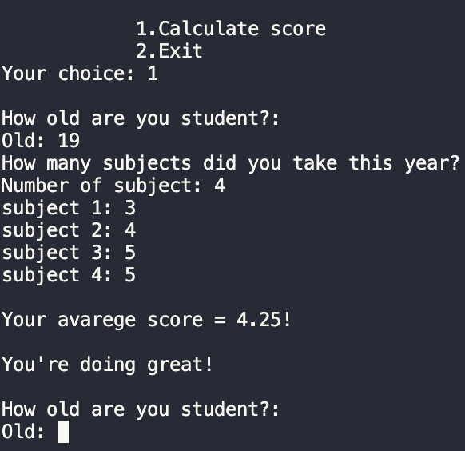
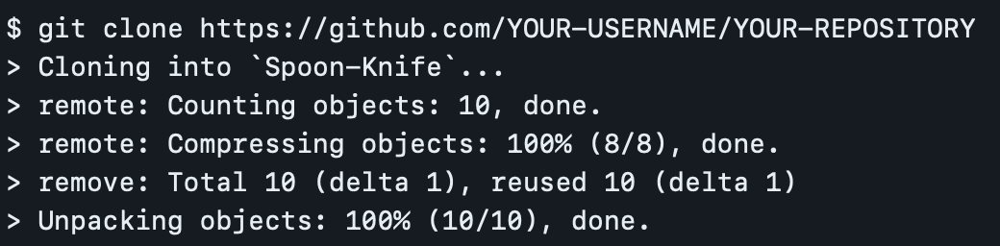

# Averagely
* ### In this development you can calculate the average score of the grades.

#### Types:
```C#
double & string 
```
#### Operators:
```C#
if(){...}
else{...}
```
The ***if-else*** construct is able to check one or more conditions, and if the condition is not true, then execute another code or check another condition.

```C#
switch
```
The ***switch*** statement provides multidirectional branching in the program.

#### Funstions:
```C#
Output to console: Console.WriteLine();
Input from console: Console.Readline();
Converts: double.Parse();
```
Also in the code i used ***Escape Characters*** - replacement of control characters in the text with corresponding text substitutions.
Learn more , [link](https://codebuns.com/csharp-basics/escape-sequences/).


#### Demo:



If statement:


Switch statement:


## Release Notes

In the [first](https://github.com/ZafarUrakov/Averagely/tree/releases/v1.0) version , we used arithmetic operations with input and output to the console.

As for this version , you may notice changes in the code like:
- Logical operators such as switch and if-else have been added.
- Simplified the code.
- Fixed the errors.

This is not all , there will be changes soon.

### You can take my code and try it yourself 👇🏻

1.About the list of files,click <> Code.


2.Copy the URL(HTTPS) of the repository.


3.Open terminal.

4.Change the current working catalogue ti the location where the cloned catalogur should be located.

5.Type "***git clone***" and paste the URL copied earlier.


6.Press enter to create a local clone.



To see other projects click [HERE](https://github.com/ZafarUrakov).