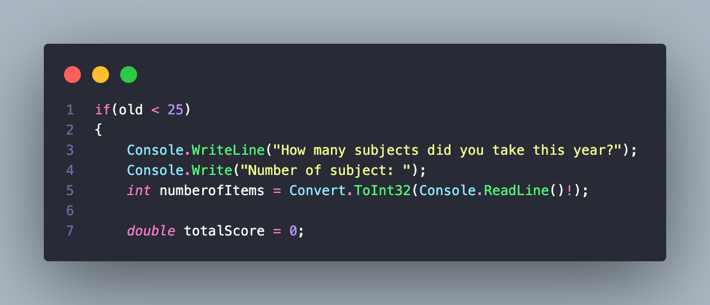
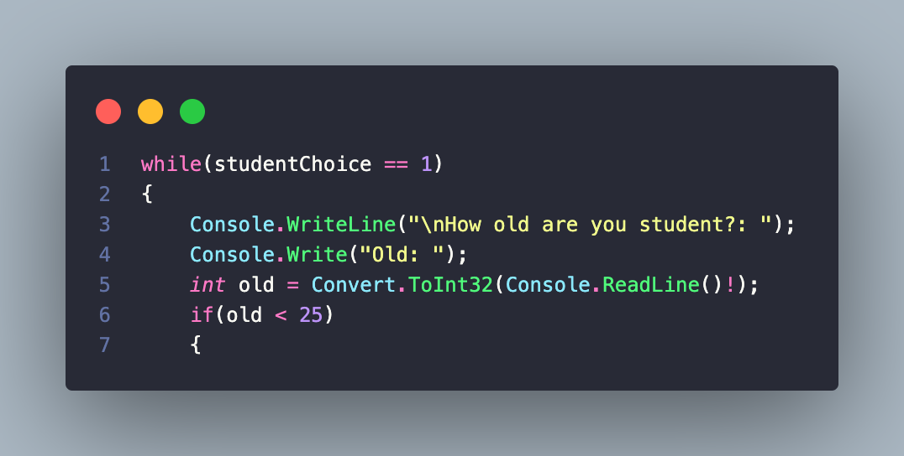
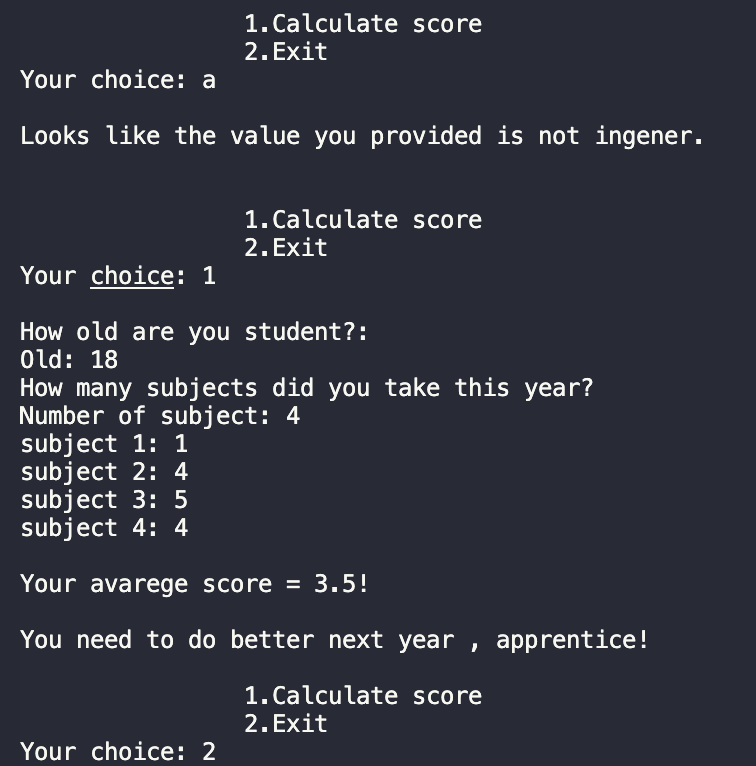

# Averagely
### In this development you can calculate the average score of the grades.

#### Types:
```C#
int & double & string

```
#### Funstions:
```C#
Output to console: Console.WriteLine();
Input from console: Console.Readline();
Converts: double.Parse();
```
#### Operators:
```C#
if(){...}
else{...}
```
The ***if-else*** construct is able to check one or more conditions, and if the condition is not true, then execute another code or check another condition.



```C#
switch
```
The ***switch*** statement provides multidirectional branching in the program.


```C#
while(){...}
for(){...}
```
Loops can execute a block of code as long as a specified condition is reached.

Loops are handy because they save time, reduce errors, and they make code more readable.

The ***while*** loop loops through a block of code as long as a specified condition is True:
```C#
while (condition) 
{
  // code block to be executed
}
```


When you know exactly how many times you want to loop through a block of code, use the ***for*** loop instead of a ***while*** loop:
```C#
for (statement 1; statement 2; statement 3) 
{
  // code block to be executed
}
```


**Statement 1** is executed (one time) before the execution of the code block.

**Statement 2** defines the condition for executing the code block.

**Statement 3** is executed (every time) after the code block has been executed.

```C#
try{...}
catch(){...}
```


Also in the code i used ***Escape Characters*** - replacement of control characters in the text with corresponding text substitutions.
Learn more , [link](https://codebuns.com/csharp-basics/escape-sequences/).


#### Demo:



## Release Notes

In the [second](https://github.com/ZafarUrakov/Averagely/tree/releases/v2.0) version , we used arithmetic operations with ***input*** and ***output*** to the console.
We also used logical operators ***if-else***.

As for this version , you may notice changes in the code like:

- Loop operations have been added.
- Add try-catch operations.
- Add Jump statement goto.
- Simplified the code.
- Fixed the errors.
  
Now the student can enter a certain number of subject(as many as he wants).

Quickly go and try to use.

### You can take my code and try it yourself 👇🏻

1.About the list of files,click <> Code.


2.Copy the URL(HTTPS) of the repository.


3.Open terminal.

4.Change the current working catalogue ti the location where the cloned catalogur should be located.

5.Type "***git clone***" and paste the URL copied earlier.


6.Press enter to create a local clone.


To see other projects click [HERE](https://github.com/ZafarUrakov).
